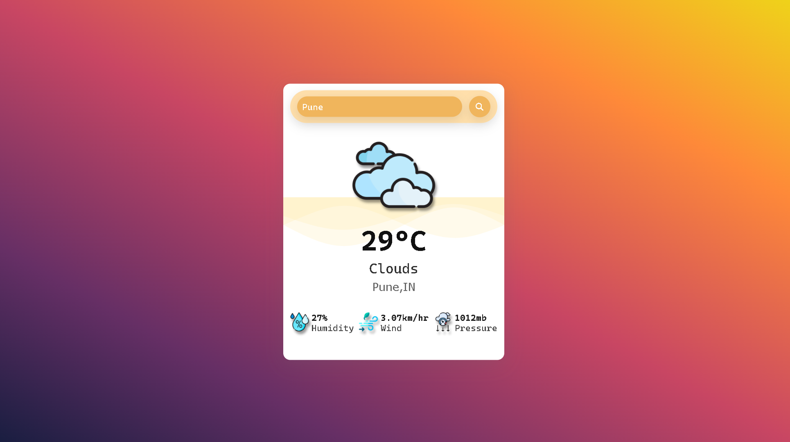

# Weatherly 🌦️

Welcome to Weatherly, your ultimate weather companion! Stay ahead of the forecast with this sleek React app powered by real-time API data.

## Features

🌍 Global Coverage: Get weather updates for any location worldwide.

⏰ Real-Time Data: Stay informed with up-to-the-minute weather information.

📅 5-Day Forecast: Plan your week with precision using our detailed forecast.

🎨 Customizable Themes: Personalize your Weatherly experience with a range of beautiful themes.

📱 Responsive Design: Access Weatherly anytime, anywhere, on any device.

## How to Use

1. Clone this repository to your local machine.
2. Install dependencies using `npm install`.
3. Start the app with `npm start`.
4. Open `localhost:3000` in your browser.

## Technologies Used

- React
- API (openweathermap.org)
- FontAwesome Icons

## Contributing

We welcome contributions from everyone! Feel free to open a PR or create an issue to suggest improvements or report bugs.

## Credits

- FontAwesome Icons
- Weather Data: ( openweathermap.org )

## License

This project is licensed under the [MIT License](LICENSE.txt).
